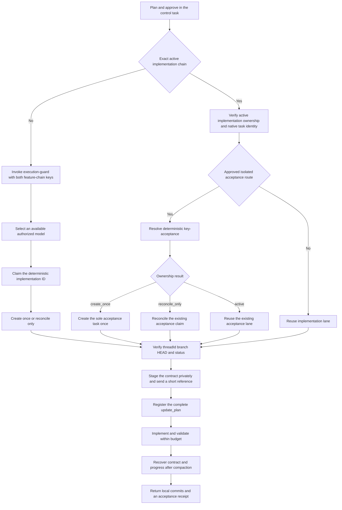

# Codex Execution Guard

[简体中文](README.md) · [English](README.en.md)

A local-first Codex plugin that keeps planning in a control task, sends implementation to one isolated execution task, and uses Hooks to guard plan registration, writes, context compaction, recovery, and completion.

Current version: `0.3.1+codex.20260812000651` · License: [MIT](LICENSE)

This is a community-maintained open-source project, not an official OpenAI product.

## What it solves

Long Codex implementation sessions often fail because execution boundaries are lossy, not because the model cannot write code:

- A high-reasoning model can spend the task on theoretical risks, extra integrity checks, and future hardening before delivering the requested feature.
- Multiple tasks can share a checkout or branch and overwrite one another's work.
- A detailed handoff can be compressed into a weak summary that loses steps, non-goals, and acceptance criteria.
- A complete contract can appear as oversized JSON in visible chat and bury the human-readable handoff.
- `create_thread` can report an error or timeout after the host already created a task; an automatic retry then creates duplicate tasks and worktrees.
- Each acceptance pass, recheck, or optimization for one feature can be misclassified as a new iteration, leaving a growing trail of `v2` and `v3` tasks and worktrees.
- An executor can invent new tasks, tests, or exit gates and keep spending without producing new delivery evidence.

Execution Guard keeps one feature chain in a recoverable execution lane: one reusable implementation task, worktree, and feature branch, stable plan steps, and evidence-based receipts. It adds one separate acceptance lane only when the environment or responsibility must be isolated, then reuses that lane for later rechecks.

## Five-minute setup

### Requirements

- A current Codex CLI or ChatGPT desktop app with plugin and Hook support.
- `python3`; the runtime uses only the Python standard library.
- Git; worktree isolation and baseline verification require a Git repository.

### 1. Add the GitHub marketplace

```bash
codex plugin marketplace add AKin-lvyifang/codex-execution-guard --ref main
```

### 2. Install the plugin

```bash
codex plugin add codex-execution-guard@codex-execution-guard
```

You can also open `/plugins` and install **Codex Execution Guard**. Restart the desktop app and start a new task after adding or updating a local marketplace.

To inspect the source or contribute, clone the repository and add its root as a local marketplace instead:

```bash
git clone https://github.com/AKin-lvyifang/codex-execution-guard.git
cd codex-execution-guard
codex plugin marketplace add "$(pwd)"
```

### 3. Review and trust the Hooks

Codex does not automatically trust command Hooks from unmanaged plugins. Open `/hooks`, inspect the current definitions, and trust this version. Review them again after the Hook definition changes.

### 4. Add a trigger to global or project `AGENTS.md`

```text
- When no matching active feature-chain ownership and control identity exists, establish that feature chain only when both are true: the current task is explicitly designated as control for the same still-pending implementation, including by a prior explicit $execution-guard invocation in its unresolved clarification chain, or the current prompt explicitly names $execution-guard; and the user approved starting or continuing a sufficiently frozen implementation in a real Git repository.
- Explicitly naming $execution-guard still requires loading the Skill and responding in the current task. Without implementation approval or frozen boundaries, stay there without a claim, execution task, branch, or worktree. The invocation remains control-intent evidence across later clarification turns for that same still-pending implementation. Once ownership is finalized as active and implementation starts, the pending designation ends by transferring its routing identity to that exact active ownership and control chain; cancellation or replacement by an independent goal ends it without handoff.
- A user-approved continuation, optimization, failed-acceptance repair, test, or documentation update whose active implementation ownership and native task identity match exactly reuses the original implementation lane. An isolated recheck whose existing sole approved acceptance ownership and native task identity match exactly reuses that acceptance lane. Neither requires another Guard invocation or control designation, creates a second implementation lane, or absorbs an independent goal.
- When that exact active implementation chain has a concrete approved isolation need and no acceptance lane exists, its inherited routing identity may deterministically claim the sole <feature-chain-key>-acceptance lane without another Guard invocation or control designation. The first claim permits at most one create; later claims reconcile or reuse, and acceptance-v2, acceptance-v3, or timestamped retry lanes are forbidden.
- Research, analysis, review, and one-off Paper, Figma, or HTML exploration stay in the current task even when they generate code or use $frontend-design; an approved production page in a real Git repository may establish a feature chain when both keys are present.
- After new-chain qualification or an exact active-chain match, task creation or reuse, model and reasoning selection, worktree and branch management, plan persistence, execution recovery, and final handoff follow that Skill. Active chain identity ends only when the feature chain is explicitly merged or cancelled. A valid marked execution contract or persisted execution resume follows the existing execution path without restating the entry gate.
- Never push, open a pull request, run remote CI, tag, release, or deploy without explicit user authorization.
```

### 5. Plan in the control task, then start

Freeze product decisions, scope, steps, and acceptance criteria with a planning-capable model. To establish a feature chain when no matching active ownership and control identity exists, send:

```text
The plan is approved. Start implementation with $execution-guard.
```

For a user-approved exact active-chain follow-up, do not repeat that invocation. Match implementation work to active implementation ownership and isolated rechecks to the existing acceptance ownership, always including native task identity, then reuse that lane. If a concrete approved isolation need appears and the chain has no acceptance lane, claim its deterministic acceptance ID through the inherited routing identity. Control otherwise establishes the new feature chain, chooses an execution model, obtains the real worktree and Git baseline, stages the complete contract privately, and sends only its short reference to the executor.

See the [full usage guide](docs/USAGE.en.md) for installation, operation, updating, and troubleshooting.

## Execution flow



Control compiles the goal, scope, frozen decisions, non-goals, plan, acceptance, Git baseline, and authorization boundaries into private canonical JSON. On the same host, visible chat carries only natural language and a short SHA-256 reference, not the full contract or planning transcript.

## Architecture

| Layer | Responsibility |
| --- | --- |
| `AGENTS.md` trigger | Requires both keys only to establish a feature chain without matching active ownership; an exact active implementation chain reuses existing lanes or claims its sole deterministic acceptance lane without another Guard invocation. |
| Control Skill | Decides create versus reuse, claims before creation, creates once or reconciles, selects a model, verifies Git, and stages the private handoff. |
| Execution Skill | Compiles and executes a versioned contract, registers a stable `update_plan`, implements locally, validates, and returns evidence. |
| Hooks | Guard marked execution sessions before writes, at plan updates, during compaction and resume, and at task stop. |
| Local state helpers | Persist one-shot creation claims, atomic ownership, private contract artifacts, and execution progress without MCP, a server, a database, or an account system. |

Read [Architecture and principles](docs/ARCHITECTURE.en.md) for the full design.

## Main capabilities

- Create or reuse based on goal, scope, and genuinely independent user value; new acceptance detail alone no longer creates a task.
- Reuse one implementation lane for an approved exact active-chain continuation, optimization, acceptance-failure fix, test, documentation update, or recheck without another Guard invocation.
- When that active implementation chain has a concrete approved isolation need, claim its sole deterministic acceptance lane without another invocation; only the first claim may create once, and every later attempt reconciles or reuses the same lane.
- Persist a locked one-shot claim before `create_thread`; an error, timeout, crash, reload, or queued `clientThreadId` never grants another create call.
- Reconcile every later claim and finalize only from exactly one real task with a complete Git identity; zero or multiple candidates stop.
- Wait for a real `threadId`; never activate execution from a queued `clientThreadId`.
- Keep the complete same-host contract in private `PLUGIN_DATA`; visible chat shows a UTF-8-bounded single-line task goal and short reference, and the Hook verifies size, digest, contract ID, session, active ownership, and Git baseline before state creation.
- Verify the worktree, branch, full `HEAD`, and Git status before implementation.
- Select only from host-advertised and user-authorized model profiles, while separating requested and verified runtime identity.
- Require the executor to register the complete approved plan with stable IDs before covered writes.
- Admit only the current deliverable, an observed failure, an acceptance item, or a direct blocker into current work.
- Treat repeated validation on unchanged code and acceptance state as duplicate evidence, not progress.
- Restore every contract boundary, the exact plan and acceptance arrays, Git identity, and evidence after compaction or resume without source-level truncation.
- Block premature completion, then keep terminal contracts write-locked and owned until a valid private-reference revision continues the same task.
- Keep ownership active through receipts, acceptance failures, and escalations; close it only when the whole feature chain is explicitly merged or cancelled.

## Who it is for

- Codex users running several feature tasks who need reliable worktree, branch, and task ownership.
- Product managers and independent developers who want a control task to translate plain-language decisions into a bounded implementation handoff.
- Users who want high-reasoning models for planning and a task-appropriate model for execution.
- Long-context or cross-module work that must survive compaction without reconstructing scope from conversation history.

It is not a replacement for a multi-user project-management system, a hardened execution sandbox, or product decisions that have not been made. A one-off script outside Git usually does not need this workflow.

## Boundaries

- Hooks are guardrails, not a security boundary, and may not cover every host tool path.
- The plugin cannot repair an incorrect or materially incomplete approved plan.
- Model discovery and actual-model verification depend on capabilities exposed by the current Codex host.
- Execution is local-only by default. The plugin never infers permission to push, open a PR, run remote CI, tag, release, or deploy.
- Fixture tests do not prove that a particular host reloaded the marketplace, discovered the Skill, or trusted the current Hooks.
- SHA-256 identifies and verifies the private contract artifact. It cannot guarantee that one host tool call never duplicates its own internal side effect.

## Documentation

- [中文使用手册](docs/USAGE.zh-CN.md) · [English usage guide](docs/USAGE.en.md)
- [中文架构与原理](docs/ARCHITECTURE.zh-CN.md) · [Architecture in English](docs/ARCHITECTURE.en.md)
- [Product and acceptance design](docs/PRODUCT_PLAN.md)
- [Contributing](CONTRIBUTING.md)
- [Security policy](SECURITY.md)
- [Changelog](CHANGELOG.md)

## Develop and validate

```bash
python3 -m unittest discover -s tests -v

python3 /path/to/skill-creator/scripts/quick_validate.py \
  plugins/codex-execution-guard/skills/execution-guard

python3 /path/to/plugin-creator/scripts/validate_plugin.py \
  plugins/codex-execution-guard
```

The current fixtures cover one-shot creation claims, concurrency and reconcile-only recovery, V1 registry migration, private contract references and binding failures, feature-chain reuse, terminal write locks, safe revision rollover, Git baseline checks, exact recovery, evidence deduplication, and completion decisions. Fresh-host installation, Hook trust, and side effects inside one host call remain explicit manual checks after restart.

## License

This project is licensed under the [MIT License](LICENSE). You may use, copy, modify, merge, publish, and distribute it while retaining the copyright and license notice. The software is provided “as is,” without warranty.
