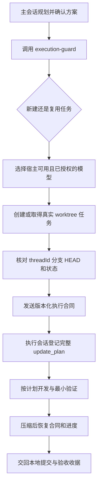

# Codex Execution Guard

[简体中文](README.md) · [English](README.en.md)

一个完全在本机运行的 Codex 插件。它让主控会话负责想清楚和派任务，让独立执行会话按确认过的计划施工，并用 Hooks 在计划登记、代码写入、上下文压缩和任务结束时提供护栏。

当前版本：`0.2.0+codex.20260809142253` · 许可证：[MIT](LICENSE)

这是一个社区开源项目，不是 OpenAI 官方产品。

## 它解决什么

长时间使用 Codex 开发时，常见问题通常不是模型不会写代码，而是执行过程缺少稳定边界：

- 强模型在理论风险、额外校验和未来加固上打转，功能迟迟没有落地。
- 多个任务共用代码目录或分支，修改互相覆盖，最后很难判断哪个现场才属于当前功能。
- 主控交付了很长的计划，执行会话经过上下文压缩后只剩摘要，步骤、非目标和验收标准逐渐变形。
- 执行会话自行增加任务、测试或退出门槛，消耗继续增长，却没有带来新的交付证据。

Execution Guard 把一次实现迭代固定成一个可恢复的执行合同：一个执行任务、一个 worktree、一个功能分支、一组稳定计划步骤，以及一张可核对的完成收据。

## 五分钟开始使用

### 环境要求

- 支持插件与 Hooks 的当前 Codex CLI 或 ChatGPT 桌面版。
- `python3`，插件运行时只使用 Python 标准库。
- Git；worktree 隔离和基线核对依赖 Git 仓库。

### 1. 添加 GitHub marketplace

```bash
codex plugin marketplace add AKin-lvyifang/codex-execution-guard --ref main
```

### 2. 安装插件

```bash
codex plugin add codex-execution-guard@codex-execution-guard
```

也可以打开 `/plugins`，在 **Codex Execution Guard** 页面完成安装。桌面版添加或更新本地 marketplace 后，请重启应用并新建任务。

如果需要检查源码或参与开发，也可以先克隆仓库，再把仓库根目录作为本地 marketplace 添加：

```bash
git clone https://github.com/AKin-lvyifang/codex-execution-guard.git
cd codex-execution-guard
codex plugin marketplace add "$(pwd)"
```

### 3. 检查并信任 Hooks

Codex 不会自动信任非托管插件的命令型 Hooks。打开 `/hooks`，阅读当前 Hook 定义并信任这一版本。Hook 内容发生变化后需要重新检查。

### 4. 在全局或项目 `AGENTS.md` 中加入触发规则

```text
当用户明确要求开始实施新功能、独立代码任务或继续既有功能时，项目主会话必须调用 $execution-guard；任务创建或复用、模型与思考强度选择、worktree 与分支管理、计划固化、执行恢复和结果收口全部以该 Skill 为准。未经用户明确授权，不得 push、创建 PR、运行远程 CI、Tag、Release 或部署。
```

### 5. 在主会话中规划并开始

先用适合规划的模型确认产品取舍、范围、步骤和验收标准。方案定好后发送：

```text
方案确认，开始执行，使用 $execution-guard。
```

主控随后判断新建还是复用任务，选择执行模型，取得真实 worktree 与 Git 基线，再把精简后的执行合同交给执行会话。

更完整的操作说明见 [中文使用手册](docs/USAGE.zh-CN.md)。

## 一次任务怎样运行



主控只发送目标、范围、已确认决定、非目标、计划、验收标准、Git 基线和授权边界，不把整段规划聊天原样复制给执行会话。

## 功能构造

| 层级 | 负责什么 |
| --- | --- |
| `AGENTS.md` 触发层 | 规定什么时候必须调用插件，不在全局提示词里堆叠完整编排流程。 |
| Control Skill | 判断新建或复用、读取宿主能力、选择模型、调用 Codex 原生任务工具并取得真实 Git 基线。 |
| Execution Skill | 编译并执行版本化合同，登记稳定的 `update_plan`，完成本地实现、验证和结果交接。 |
| Hooks | 在标记过的执行会话中检查写入前置条件、保存压缩检查点、恢复状态并阻止无证据的提前结束。 |
| 本地状态脚本 | 原子保存任务归属与执行进度；不需要 MCP、服务器、数据库或账号系统。 |

详细设计见 [架构与原理](docs/ARCHITECTURE.zh-CN.md)。

## 主要能力

- 按用户目标、范围和验收标准决定继续原任务还是创建新任务。
- 等待真实 `threadId`，不把排队中的 `clientThreadId` 当成可执行任务。
- 核对 worktree、分支、完整 `HEAD` 和 Git 状态，避免在错误现场开始开发。
- 从宿主实际提供的模型与用户授权池的交集中选择执行模型，并区分“已请求”与“实际运行已核对”。
- 要求执行会话在写代码前原样登记完整计划，保留稳定步骤编号且同时最多执行一步。
- 只允许当前交付物、真实失败、验收项或直接阻塞进入当前工作，其他风险记录后交回主控。
- 对相同代码和验收状态下的重复验证去重，不把重复检查当成新进展。
- 在上下文压缩或重新进入任务后恢复合同、当前步骤、Git 身份和已有证据。
- 计划与验收未完成时阻止草草结束；完成后生成本地提交、改动、验证和未验证项收据。

## 适合谁

- 用 Codex 同时规划和开发多个功能，担心 worktree、分支或任务归属混乱的人。
- 不想手动编写长篇技术提示，希望主控把自然语言需求整理成执行合同的产品经理和独立开发者。
- 需要用高思考模型做取舍，再把明确实现交给更合适模型执行的用户。
- 经常处理长上下文、跨模块实现，或者需要在压缩后继续稳定执行的项目。

以下场景不适合把它当成解决方案：没有 Git 仓库的一次性脚本、需要多人实时项目管理的平台、必须提供强安全隔离的执行沙箱，以及尚未确定产品范围却希望执行会话自行决策的任务。

## 能力边界

- Hooks 是执行护栏，不是安全边界，无法保证覆盖宿主提供的所有工具路径。
- 插件不会修复一份本身就错误或缺少关键决定的计划；不确定性必须留在主控处理。
- 模型发现与实际模型核对取决于当前 Codex 宿主暴露的能力。
- 插件默认只进行本地开发和验证，不会自行 push、创建 PR、运行远程 CI、Tag、Release 或部署。
- 单元测试证明状态机和固定载荷行为，不等于真实宿主已经重载 marketplace、发现 Skill 或信任了最新 Hooks。

## 文档

- [中文使用手册](docs/USAGE.zh-CN.md) · [English usage guide](docs/USAGE.en.md)
- [中文架构与原理](docs/ARCHITECTURE.zh-CN.md) · [Architecture in English](docs/ARCHITECTURE.en.md)
- [产品与验收设计](docs/PRODUCT_PLAN.md)
- [贡献指南](CONTRIBUTING.md)
- [安全政策](SECURITY.md)
- [变更记录](CHANGELOG.md)

## 本地开发与验证

```bash
python3 -m unittest discover -s tests -v

python3 /path/to/skill-creator/scripts/quick_validate.py \
  plugins/codex-execution-guard/skills/execution-guard

python3 /path/to/plugin-creator/scripts/validate_plugin.py \
  plugins/codex-execution-guard
```

当前固定测试覆盖任务归属、并发写入、基线校验、计划登记、压缩恢复、验证去重和完成判断。真实宿主安装与 Hook 信任仍需在新任务中手动确认。

## 许可证

本项目采用 [MIT License](LICENSE)。你可以使用、复制、修改、合并、发布和分发本项目，但需要保留原许可证与版权声明。软件按“原样”提供，不包含任何明示或暗示担保。
