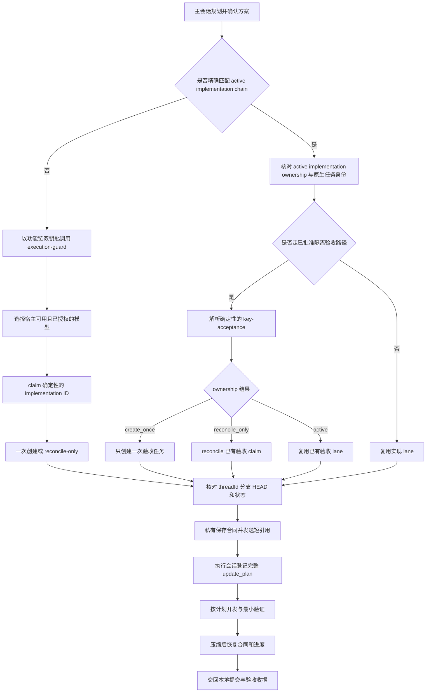

# Codex Execution Guard

[简体中文](README.md) · [English](README.en.md)

一个完全在本机运行的 Codex 插件。它让主控会话负责想清楚和派任务，让独立执行会话按确认过的计划施工，并用 Hooks 在计划登记、代码写入、上下文压缩和任务结束时提供护栏。

当前版本：`0.3.2+codex.20260812154508` · 许可证：[MIT](LICENSE)

这是一个社区开源项目，不是 OpenAI 官方产品。

## 它解决什么

长时间使用 Codex 开发时，常见问题通常不是模型不会写代码，而是执行过程缺少稳定边界：

- 强模型在理论风险、额外校验和未来加固上打转，功能迟迟没有落地。
- 多个任务共用代码目录或分支，修改互相覆盖，最后很难判断哪个现场才属于当前功能。
- 主控交付了很长的计划，执行会话经过上下文压缩后只剩摘要，步骤、非目标和验收标准逐渐变形。
- 完整合同以超长 JSON 出现在聊天正文里，真正需要人阅读的交接信息反而被淹没。
- `create_thread` 报错或超时，但宿主其实已经创建任务；主控自动重试后出现重复任务和 worktree。
- 同一功能每次验收、复验或优化都被当成新迭代，留下 `v2`、`v3` 等越来越多的任务和 worktree。
- 执行会话自行增加任务、测试或退出门槛，消耗继续增长，却没有带来新的交付证据。

Execution Guard 把同一功能的实现链固定在可恢复的执行现场：一个长期复用的实现任务、worktree 和功能分支，一组稳定计划步骤，以及可核对的完成收据。只有验收确实需要隔离环境或职责时，才建立一个独立验收现场，后续复验继续复用它。

## 五分钟开始使用

### 环境要求

- 支持插件与 Hooks 的当前 Codex CLI 或 ChatGPT 桌面版。
- `python3`，插件运行时只使用 Python 标准库。
- Git；worktree 隔离和基线核对依赖 Git 仓库。

### 1. 添加 GitHub marketplace

```bash
codex plugin marketplace add AKin-lvyifang/codex-execution-guard --ref main
```

### 2. 安装插件

```bash
codex plugin add codex-execution-guard@codex-execution-guard
```

也可以打开 `/plugins`，在 **Codex Execution Guard** 页面完成安装。桌面版添加或更新本地 marketplace 后，请重启应用并新建任务。

如果需要检查源码或参与开发，也可以先克隆仓库，再把仓库根目录作为本地 marketplace 添加：

```bash
git clone https://github.com/AKin-lvyifang/codex-execution-guard.git
cd codex-execution-guard
codex plugin marketplace add "$(pwd)"
```

### 3. 检查并信任 Hooks

Codex 不会自动信任非托管插件的命令型 Hooks。打开 `/hooks`，阅读当前 Hook 定义并信任这一版本。Hook 内容发生变化后需要重新检查。

### 4. 在全局或项目 `AGENTS.md` 中加入触发规则

```text
- 若不存在精确匹配且仍为 active 的功能链 ownership 与 control 身份，只有在以下两项同时成立时，项目主会话才可建立该功能链：当前任务已针对同一项尚未开始的实施被明确指定为 control（包括此前在该未解决澄清链中明确点名 $execution-guard），或用户当前提示明确点名 $execution-guard；且用户已批准开始或继续边界充分冻结的真实 Git 仓库实施。
- 用户明确点名 $execution-guard 时，仍必须加载该 Skill 并在当前任务回应；若实施批准或冻结边界不足，则留在当前任务，不 claim、创建或复用执行任务，也不新建分支或 worktree。只要讨论的仍是同一项尚未开始的实施，此前的显式调用就在后续澄清轮次中继续作为 control 意图证据。ownership 完成 finalize 并进入 active 状态后才开始实施，此时 pending control 指定结束，路由身份由该 active ownership 及其 control chain 接续；用户取消或以独立目标替换时则直接结束，不发生交接。
- 已获用户批准的继续实施、优化、验收失败修复、测试或文档更新，只有在 active implementation ownership 与原生任务身份精确匹配时，才复用原实现 lane。隔离复验则必须精确匹配已经存在的唯一验收 ownership 与原生任务身份，才能复用验收 lane。两者都无需再次点名 Guard 或指定 control，不得创建第二条实现 lane，也不得吸收独立目标。
- 该 active implementation chain 后来出现已获批准的具体隔离需求，且尚无验收 lane 时，可沿用既有路由身份直接确定性 claim 唯一的 <feature-chain-key>-acceptance lane，无需再次点名 Guard 或指定 control。第一次 claim 最多授权创建一次；后续 claim 只 reconcile 或复用，禁止 acceptance-v2、acceptance-v3 和带时间戳的重试 lane。
- 研究、分析、评审及一次性的 Paper、Figma、HTML 探索即使产生代码或使用 $frontend-design 也默认留在当前任务；真实仓库中的正式页面实施在两项同时满足时可以建立功能链。
- 新功能链通过双钥匙，或后续工作通过 active chain 精确匹配后，任务创建或复用、模型与思考强度选择、worktree 与分支管理、计划固化、执行恢复和结果收口全部以该 Skill 为准。active 功能链身份只在明确 merged 或 cancelled 后结束。有效标记的执行合同或持久化执行恢复直接遵循既有 execution 路径，无需重复入口条件。
- 未经用户明确授权，不得 push、创建 PR、运行远程 CI、Tag、Release 或部署。
```

### 5. 在主会话中规划并开始

先用适合规划的模型确认产品取舍、范围、步骤和验收标准。没有匹配的 active 功能链 ownership 与 control 身份、准备建立新功能链时发送：

```text
方案确认，开始执行，使用 $execution-guard。
```

同一 active chain 的后续工作已获用户批准时，不重复发送这条调用。实现工作核对 active implementation ownership，隔离复验核对已有验收 ownership，两者都必须匹配原生任务身份，然后复用对应 lane。如果后来出现已获批准的具体隔离需求且还没有验收 lane，就沿用该链的路由身份 claim 确定性的验收 ID。其他情况由主控建立新功能链，选择执行模型，取得真实 worktree 与 Git 基线，把完整合同私有保存后，只向执行会话发送短引用。

更完整的操作说明见 [中文使用手册](docs/USAGE.zh-CN.md)。

## 一次任务怎样运行



主控把目标、范围、已确认决定、非目标、计划、验收标准、Git 基线和授权边界编译成私有 canonical JSON。同一宿主默认只在聊天中发送自然语言和短 SHA-256 引用，不把完整合同或整段规划聊天复制进正文。

## 功能构造

| 层级 | 负责什么 |
| --- | --- |
| `AGENTS.md` 触发层 | 没有匹配的 active 功能链时，以双钥匙约束功能链建立；精确匹配的 active implementation chain 无需再次点名 Guard，可复用现有 lane 或 claim 唯一的确定性验收 lane。 |
| Control Skill | 判断新建或复用、创建前 claim、一次原生创建或 reconcile、模型选择、Git 基线与私有合同交接。 |
| Execution Skill | 编译并执行版本化合同，登记稳定的 `update_plan`，完成本地实现、验证和结果交接。 |
| Hooks | 在 Guard bootstrap 创建前预检原生参数；在标记过的执行会话中检查写入前置条件、保存压缩检查点、恢复状态并阻止无证据的提前结束。 |
| 本地状态脚本 | 用一次性创建 claim、原子任务归属和私有合同 artifact 保存控制状态；不需要 MCP、服务器、数据库或账号系统。 |

详细设计见 [架构与原理](docs/ARCHITECTURE.zh-CN.md)。

## 主要能力

- 按用户目标、范围和真实独立价值决定继续原任务还是创建新任务；新增验收细节本身不再触发新建。
- 已批准且精确匹配 active chain 的继续实施、优化、验收失败修复、测试、文档更新和复验无需再次点名 Guard，固定复用原实现现场或已有验收现场。
- active implementation chain 出现已批准的具体隔离需求时，无需再次调用即可 claim 唯一的确定性验收 lane；只有第一次 claim 可以创建一次，后续全部 reconcile 或复用。
- 在调用 `create_thread` 前持锁写入一次性 claim；报错、超时、崩溃、重载或只返回 `clientThreadId` 都不会重新授权创建。
- Guard bootstrap 使用独立标记和固定的 project/worktree 结构；Hook 会在请求到达宿主前拦截顶层 `projectId`、错误环境或不完整的 branch `startingState`。只有明确写明 `before host dispatch` 的本地预检拒绝可以修正后重发，预检通过后仍遵守一次调用规则。
- 对已 claim 的迭代只做 reconcile；只有恰好一个真实任务和完整 Git 现场才能原子变为 active，零个或多个候选都会停止。
- 等待真实 `threadId`，不把排队中的 `clientThreadId` 当成可执行任务。
- 同一宿主把完整合同保存在私有 `PLUGIN_DATA`，聊天只显示经过 UTF-8 字节上限处理的单行任务目标与短引用；Hook 在创建状态前核对大小、摘要、合同 ID、session、active ownership 和 Git 基线。
- 核对 worktree、分支、完整 `HEAD` 和 Git 状态，避免在错误现场开始开发。
- 从宿主实际提供的模型与用户授权池的交集中选择执行模型，并区分“已请求”与“实际运行已核对”。
- 要求执行会话在写代码前原样登记完整计划，保留稳定步骤编号且同时最多执行一步。
- 只允许当前交付物、真实失败、验收项或直接阻塞进入当前工作，其他风险记录后交回主控。
- 对相同代码和验收状态下的重复验证去重，不把重复检查当成新进展。
- 在上下文压缩或重新进入任务后恢复全部合同边界、完整计划与验收、Git 身份和已有证据，不在插件源码中静默截断。
- 计划与验收未完成时阻止草草结束；完成或升级后保持写锁和任务归属，只有同一任务上的合法私有引用才能继续。
- 完成收据、验收失败或升级不会关闭任务归属；只有整条功能链明确合并或取消后才关闭。

## 适合谁

- 用 Codex 同时规划和开发多个功能，担心 worktree、分支或任务归属混乱的人。
- 不想手动编写长篇技术提示，希望主控把自然语言需求整理成执行合同的产品经理和独立开发者。
- 需要用高思考模型做取舍，再把明确实现交给更合适模型执行的用户。
- 经常处理长上下文、跨模块实现，或者需要在压缩后继续稳定执行的项目。

以下场景不适合把它当成解决方案：没有 Git 仓库的一次性脚本、需要多人实时项目管理的平台、必须提供强安全隔离的执行沙箱，以及尚未确定产品范围却希望执行会话自行决策的任务。

## 能力边界

- Hooks 是执行护栏，不是安全边界，无法保证覆盖宿主提供的所有工具路径。
- 插件不会修复一份本身就错误或缺少关键决定的计划；不确定性必须留在主控处理。
- 模型发现与实际模型核对取决于当前 Codex 宿主暴露的能力。
- 插件默认只进行本地开发和验证，不会自行 push、创建 PR、运行远程 CI、Tag、Release 或部署。
- 单元测试证明状态机和固定载荷行为，不等于真实宿主已经重载 marketplace、发现 Skill 或信任了最新 Hooks。
- SHA-256 只用于定位和核验私有合同 artifact，不保证宿主工具调用本身绝不会产生重复副作用；一次宿主调用内部的重复仍属于宿主边界。

## 文档

- [中文使用手册](docs/USAGE.zh-CN.md) · [English usage guide](docs/USAGE.en.md)
- [中文架构与原理](docs/ARCHITECTURE.zh-CN.md) · [Architecture in English](docs/ARCHITECTURE.en.md)
- [产品与验收设计](docs/PRODUCT_PLAN.md)
- [贡献指南](CONTRIBUTING.md)
- [安全政策](SECURITY.md)
- [变更记录](CHANGELOG.md)

## 本地开发与验证

```bash
python3 -m unittest discover -s tests -v

python3 /path/to/skill-creator/scripts/quick_validate.py \
  plugins/codex-execution-guard/skills/execution-guard

python3 /path/to/plugin-creator/scripts/validate_plugin.py \
  plugins/codex-execution-guard
```

当前固定测试覆盖 Guard bootstrap 参数预检、普通 `create_thread` 不受影响、一次性创建 claim、并发与 reconcile-only、V1 registry 迁移、私有合同引用及错误绑定、功能链复用、终态写锁、安全续接、基线校验、完整恢复、验证去重和完成判断。真实宿主安装、Hook 信任和宿主内部单次调用副作用仍需在重启后的真实环境中确认。

## 许可证

本项目采用 [MIT License](LICENSE)。你可以使用、复制、修改、合并、发布和分发本项目，但需要保留原许可证与版权声明。软件按“原样”提供，不包含任何明示或暗示担保。
