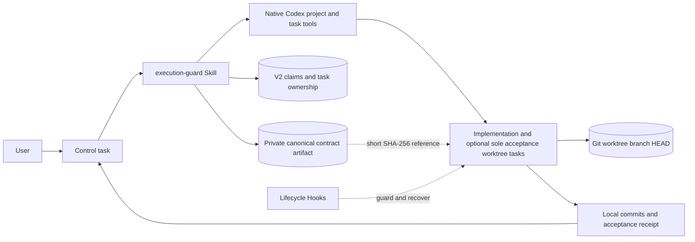

# Codex Execution Guard Architecture and Principles

[简体中文](ARCHITECTURE.zh-CN.md)

## Design goal

Execution Guard addresses one question: how does an approved implementation plan remain stable until delivery? It does not replace product planning, native Codex task tools, or Git. It establishes a recoverable and verifiable boundary between them.

Reliable execution needs four durable elements:

1. Approved intent: goal, scope, decisions, non-goals, authorization, and acceptance.
2. Isolated state: one implementation task, worktree, and branch per feature chain, plus at most one deterministic acceptance lane for an approved isolation need.
3. Recoverable progress: stable plan IDs, current status, deviations, and validation evidence.
4. A bounded exit: completion is evaluated against the approved contract, not newly invented gates.

Conversation history is lossy and can be compacted. Git state persists and directly affects code. The plugin therefore stores a small structured execution state instead of replaying a planning transcript.

## System overview

### Trigger layer

`AGENTS.md` keeps feature-chain establishment separate from lane routing. Without matching active feature-chain ownership and control identity, explicit control intent and an approved, sufficiently frozen real-repository implementation are both required to establish the chain. A prior explicit invocation remains evidence through clarification, then transfers routing identity to the exact active ownership and control chain when implementation starts; cancellation or an independent replacement ends it without handoff. An approved exact active-chain follow-up reuses the implementation lane or an existing acceptance lane without another Guard invocation only after the selected lane's active ownership and native task identity match. If that active implementation chain later has a concrete approved isolation need, the inherited identity may claim its sole deterministic acceptance lane: the first claim may create once, and later claims reconcile or reuse without retry-suffixed IDs. The chain identity ends when explicitly merged or cancelled. Skill-only invocation, research or review, and one-off Paper, Figma, or HTML exploration stay in the current task even when they generate code or use `$frontend-design`. The trigger does not embed tool order, model policy, contract fields, or the Hook state machine.

### Control Skill

The control path owns product ambiguity, create-versus-reuse, host capability evidence, authorized model routing, a durable one-shot claim before creation, one native create call, task reconciliation, real `threadId` readiness, worktree and baseline acquisition, atomic ownership finalization, and private contract staging.

Control never uses a local helper to fabricate a Codex task. The local registry records identities already obtained from native tools.

### Execution Skill

The execution path accepts only a valid versioned contract or persisted recovery state. It verifies Git identity, registers the exact stable `update_plan`, implements and validates locally, records allowed implementation notes, escalates material changes with evidence, and returns a structured receipt.

The execution task cannot create, fork, delegate, or hand off another task.

### Lifecycle Hooks

| Event | Responsibility |
| --- | --- |
| `UserPromptSubmit` | Resolve inline V1 or a private reference and validate its artifact before state creation. |
| `PreToolUse` | Preflight marked Guard bootstrap `create_thread` arguments in control, then deny covered execution writes until environment and plan registration are ready. |
| `PostToolUse` | Record plan transitions and meaningful validation evidence. |
| `PreCompact` | Persist the already-structured checkpoint. |
| `SessionStart` | Restore every contract boundary and exact plan and acceptance state after resume or compaction. |
| `Stop` | Continue incomplete work and allow completion or a valid escalation. |

An ordinary session without either marker remains fail-open: no guard state is created and tools are not blocked. The bootstrap marker enables only one `create_thread` payload preflight and does not create execution state.

## Two-stage handoff

When control creates a new worktree task, it does not yet know the real path, branch, or `HEAD`. A contract cannot safely guess them.

Stage one atomically claims the iteration in the V2 registry, then submits one native create request with the `CODEX_EXECUTION_GUARD_BOOTSTRAP_V1` preflight marker but no execution-contract marker. Before host dispatch, the Hook validates the canonical project/worktree target. Only an explicit local denial before dispatch permits a corrected submission. After preflight passes, a `clientThreadId`, error, or timeout never renews creation permission; every later entry reconciles. Zero or multiple candidates stop. Exactly one real `threadId` may continue to environment verification.

Stage two atomically finalizes the verified candidate to active ownership, stores the canonical contract in target-host private `PLUGIN_DATA`, and sends only the marker plus a short SHA-256 reference. The Hook validates the artifact, ownership, and live baseline before state creation, then the executor registers the plan. This prevents both a guessed environment and oversized JSON in visible chat.

## Local ownership registry

`control_plane.py` keeps V2 records at the established target-host private path `PLUGIN_DATA/control/iterations.json`. A `claimed` record contains only iteration, project, and title—never `clientThreadId`, real task, or Git identity. `active` adds host, real thread, worktree, branch, and full baseline. `closed` retains that ownership snapshot.

Mutation uses a stable sidecar process lock, reload and validation after lock acquisition, a lock held across the complete read-modify-write transaction, and atomic file replacement. Concurrent control tasks therefore cannot overwrite committed records with stale snapshots. Corrupt JSON, duplicate ownership, incomplete records, and stale baselines stop without overwrite.

The first claim returns the one `create_once`; every later claim permanently returns `reconcile_only`. Claims do not clear or expire, so errors, timeouts, crashes, and reloads cannot authorize a second create. V1 remains readable and migrates as a unit on the next locked write.

The registry itself adds no checksum because locking, structural validation, and atomic replacement cover its concurrency boundary. SHA-256 is limited to the contract artifact below, where reproduced visible-contract and prompt-binding failures establish a concrete integrity boundary.

## Private contract handoff

`contract_protocol.py` wraps the complete contract and active ownership in canonical JSON bound to contract ID, target session, host, thread, worktree, branch, and baseline. The artifact is limited to 1 MiB, named by its content SHA-256, and stored under `PLUGIN_DATA/contracts/`.

Visible chat receives the contract ID, a single-line `goal` summary under a 599-byte total UTF-8 cap, the activation marker, and one digest reference. Before session state exists, the Hook validates format, size, hash, contract ID, session, V2 active ownership, contract baseline, and live Git. Any mismatch fails closed, as does a prompt containing both reference and inline JSON.

Inline V1 remains compatible. The explicitly labeled folded-inline fallback is only for cross-host control that cannot write target `PLUGIN_DATA`; a same-host artifact failure never silently downgrades.

## Execution state

`execution_guard.py` persists the session contract, environment readiness, plan and acceptance state, current Git identity, evidence, and escalation. State uses local atomic JSON replacement. Activation and compact/resume private Hook context carries every contract boundary plus the exact current plan and acceptance arrays without source-level character truncation.

The plugin does not store full transcripts, credentials, telemetry, or remote account data. Absolute paths belong only to the live local contract and must not be committed to examples or source.

## Stable plan semantics

Every plan and acceptance item has a stable ID. Each update sends the complete ordered plan, changes only status and allowed concise notes, and keeps at most one item `in_progress`.

New IDs, deletions, rewritten steps, reordering, wider paths, or weaker acceptance are contract changes. The plugin does not approve them; it requires the executor to return evidence to control.

## Forward progress and validation budget

Current work must connect to the deliverable, an observed failure, approved acceptance, or a direct blocker. Future production hardening, theoretical risks, optional capability, and unrelated cleanup stay outside the plan.

Validation evidence is keyed to command, outcome, Git state, current step, and acceptance state. Repeating the same check on unchanged state is not progress; a failed result followed by a pass is new evidence. This limits loops without blocking real root-cause diagnosis.

## Model routing

Routing keeps three facts separate: model and reasoning combinations advertised by the host, the user's authorized pool, and runtime identity reported by the host.

Selection must be inside the intersection of the first two. Acceptance at task creation does not prove the third. When runtime identity is unavailable, the receipt says `actual model unverified`. The plugin does not silently increase reasoning or add review passes.

## Failure strategy

- Local state errors do not affect an ordinary unmarked session.
- A baseline mismatch in an active contract stops covered writes and returns a concrete recovery message.
- Registry and native-task disagreement returns to control.
- A marked Guard bootstrap with a non-canonical project/worktree target is denied before host dispatch; ordinary unmarked `create_thread` calls are not preflighted.
- A claimed create never retries after error, timeout, or queue state; reconciliation with zero or multiple candidates stops.
- A missing, oversized, tampered, or wrongly bound private contract creates no partial session state and never silently falls back inline.
- Missing product decisions, new plan IDs, or changed acceptance return to control.
- A host that cannot expose a real task and environment identity cannot start guarded execution.

These stops protect the current covered write path. They are not a general sandbox or a complete security boundary.

## Security and privacy boundary

- No MCP server, hosted service, database, telemetry, or runtime network request.
- Hook commands invoke only Python scripts inside the plugin.
- Registry and execution state stay in a user-selected local writable path.
- Remote Git and publishing operations remain forbidden by default until the current goal receives explicit authorization.
- Hooks may not intercept every host tool path and must not be treated as a security boundary.

See [SECURITY.md](../SECURITY.md) for the reporting policy.
