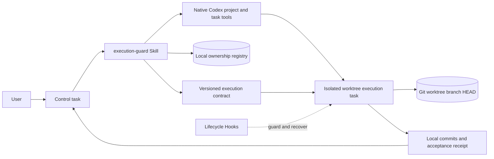

# Codex Execution Guard Architecture and Principles

[简体中文](ARCHITECTURE.zh-CN.md)

## Design goal

Execution Guard addresses one question: how does an approved implementation plan remain stable until delivery? It does not replace product planning, native Codex task tools, or Git. It establishes a recoverable and verifiable boundary between them.

Reliable execution needs four durable elements:

1. Approved intent: goal, scope, decisions, non-goals, authorization, and acceptance.
2. Isolated state: one execution task, one worktree, and one feature branch.
3. Recoverable progress: stable plan IDs, current status, deviations, and validation evidence.
4. A bounded exit: completion is evaluated against the approved contract, not newly invented gates.

Conversation history is lossy and can be compacted. Git state persists and directly affects code. The plugin therefore stores a small structured execution state instead of replaying a planning transcript.

## System overview

### Trigger layer

`AGENTS.md` defines when `$execution-guard` is mandatory. It does not embed tool order, model policy, contract fields, or the Hook state machine, keeping the global prompt small.

### Control Skill

The control path owns product ambiguity, create-versus-reuse, host capability evidence, authorized model routing, native Codex project and task calls, real `threadId` readiness, worktree and baseline acquisition, ownership persistence, and contract compilation.

Control never uses a local helper to fabricate a Codex task. The local registry records identities already obtained from native tools.

### Execution Skill

The execution path accepts only a valid versioned contract or persisted recovery state. It verifies Git identity, registers the exact stable `update_plan`, implements and validates locally, records allowed implementation notes, escalates material changes with evidence, and returns a structured receipt.

The execution task cannot create, fork, delegate, or hand off another task.

### Lifecycle Hooks

| Event | Responsibility |
| --- | --- |
| `UserPromptSubmit` | Recognize and persist a valid contract. |
| `PreToolUse` | Deny covered writes until environment and plan registration are ready. |
| `PostToolUse` | Record plan transitions and meaningful validation evidence. |
| `PreCompact` | Persist the already-structured checkpoint. |
| `SessionStart` | Restore concise state after resume or compaction. |
| `Stop` | Continue incomplete work and allow completion or a valid escalation. |

An ordinary session without the marker remains fail-open: no guard state is created and tools are not blocked.

## Two-stage handoff

When control creates a new worktree task, it does not yet know the real path, branch, or `HEAD`. A contract cannot safely guess them.

Stage one sends a marker-free bootstrap that permits only the unique branch setup and environment report. `clientThreadId` remains queue state. Control waits for the real `threadId`, validates the report and clean status, and persists ownership.

Stage two sends the marker and complete contract. The execution task compares the real baseline, registers the plan, and begins writes. This order prevents a contract from targeting an environment that does not exist.

## Local ownership registry

`control_plane.py` stores iteration records at one explicitly selected private path outside the repository. A record contains project, real task, title, worktree, branch, full baseline, and active or closed status.

Mutation uses a stable sidecar process lock, reload and validation after lock acquisition, a lock held across the complete read-modify-write transaction, and atomic file replacement. Concurrent control tasks therefore cannot overwrite committed records with stale snapshots. Corrupt JSON, duplicate ownership, incomplete records, and stale baselines stop without overwrite.

No checksum or fingerprint layer is added because process locking, validation, and atomic replacement satisfy the current threat boundary.

## Execution state

`execution_guard.py` persists the session contract, environment readiness, plan and acceptance state, current Git identity, evidence, and escalation. State uses local atomic JSON replacement.

The plugin does not store full transcripts, credentials, telemetry, or remote account data. Absolute paths belong only to the live local contract and must not be committed to examples or source.

## Stable plan semantics

Every plan and acceptance item has a stable ID. Each update sends the complete ordered plan, changes only status and allowed concise notes, and keeps at most one item `in_progress`.

New IDs, deletions, rewritten steps, reordering, wider paths, or weaker acceptance are contract changes. The plugin does not approve them; it requires the executor to return evidence to control.

## Forward progress and validation budget

Current work must connect to the deliverable, an observed failure, approved acceptance, or a direct blocker. Future production hardening, theoretical risks, optional capability, and unrelated cleanup stay outside the plan.

Validation evidence is keyed to command, outcome, Git state, current step, and acceptance state. Repeating the same check on unchanged state is not progress; a failed result followed by a pass is new evidence. This limits loops without blocking real root-cause diagnosis.

## Model routing

Routing keeps three facts separate: model and reasoning combinations advertised by the host, the user's authorized pool, and runtime identity reported by the host.

Selection must be inside the intersection of the first two. Acceptance at task creation does not prove the third. When runtime identity is unavailable, the receipt says `actual model unverified`. The plugin does not silently increase reasoning or add review passes.

## Failure strategy

- Local state errors do not affect an ordinary unmarked session.
- A baseline mismatch in an active contract stops covered writes and returns a concrete recovery message.
- Registry and native-task disagreement returns to control.
- Missing product decisions, new plan IDs, or changed acceptance return to control.
- A host that cannot expose a real task and environment identity cannot start guarded execution.

These stops protect the current covered write path. They are not a general sandbox or a complete security boundary.

## Security and privacy boundary

- No MCP server, hosted service, database, telemetry, or runtime network request.
- Hook commands invoke only Python scripts inside the plugin.
- Registry and execution state stay in a user-selected local writable path.
- Remote Git and publishing operations remain forbidden by default until the current goal receives explicit authorization.
- Hooks may not intercept every host tool path and must not be treated as a security boundary.

See [SECURITY.md](../SECURITY.md) for the reporting policy.
