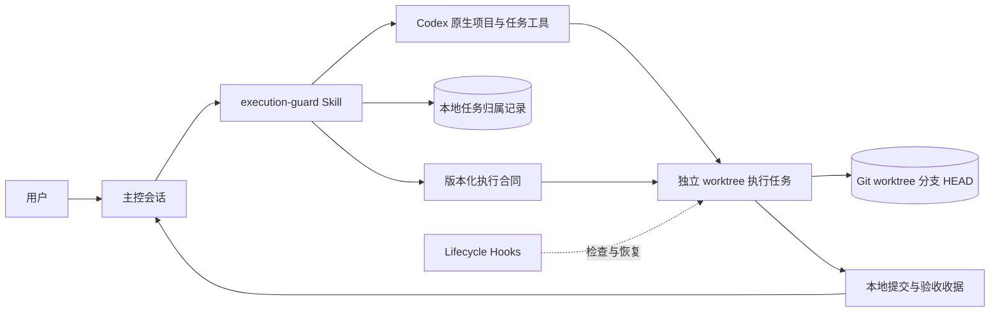

# Codex Execution Guard 架构与原理

[English](ARCHITECTURE.en.md)

## 设计目标

Execution Guard 解决的是“已经确认的实现计划怎样稳定落地”。它不替代产品规划、Codex 原生任务工具或 Git，而是在三者之间建立一份可恢复、可核对的执行边界。

可靠执行需要四种持久信息：

1. 已批准意图：目标、范围、决定、非目标、授权和验收标准。
2. 隔离现场：一个执行任务、一个 worktree、一个功能分支。
3. 可恢复进度：稳定计划编号、当前状态、偏差和验证证据。
4. 有边界的出口：按批准合同判断完成，不由执行者继续发明新门槛。

聊天历史会压缩，Git 状态会长期保留并直接影响代码。插件因此把关键执行信息保存成小而明确的结构，不依赖重放整段讨论。

## 总体结构

### 触发层

`AGENTS.md` 只规定什么时候必须调用 `$execution-guard`。它不保存工具调用顺序、模型策略、合同字段或 Hook 状态机，避免全局上下文被实现细节占满。

### Control Skill

Control 路径负责保留产品不确定性和最终决定、判断新建或复用、读取宿主能力、在授权池内路由模型、调用 Codex 原生任务工具、等待真实 `threadId`、取得 worktree 与 Git 基线、持久化迭代所有权并编译执行合同。

Control 不用本地脚本伪造 Codex 任务。本地 registry 只记录已经由原生工具取得的真实身份。

### Execution Skill

Execution 路径只接受合法的版本化合同或已经保存的恢复状态。它核对 Git 现场、原样登记完整 `update_plan`、在允许范围内实现与验证、记录不改变合同的实现说明、把材料变化带回主控，并生成结构化收据。

执行任务不得创建、fork、委派或交接另一个任务。

### Lifecycle Hooks

| 事件 | 作用 |
| --- | --- |
| `UserPromptSubmit` | 识别并保存合法执行合同。 |
| `PreToolUse` | 在环境和计划未就绪时拦截受覆盖的写操作。 |
| `PostToolUse` | 记录计划变化和有意义的验证证据。 |
| `PreCompact` | 保存已经结构化的检查点。 |
| `SessionStart` | 在 resume 或 compact 后恢复精简状态。 |
| `Stop` | 未完成时要求继续，完成或合法升级时允许交付。 |

没有标记的普通会话保持 fail-open：不创建 guard 状态，也不阻止工具。

## 两阶段交接

主控创建新 worktree 任务时还不知道真实路径、分支和 `HEAD`，因此不能直接编造合同基线。

第一阶段发送不带标记的 bootstrap，只允许建立唯一分支和报告环境身份。`clientThreadId` 仍然只是排队信息。主控取得真实 `threadId` 和环境报告后，验证干净状态并写入所有权记录。

第二阶段才发送标记和完整合同。执行会话核对基线、登记计划，然后开始写入。这个顺序避免了“合同先写了一个不存在的现场”。

## 本地所有权记录

`control_plane.py` 在明确指定的仓库外私有路径保存迭代记录。每条记录包含项目、真实任务、标题、worktree、分支、完整基线和 active 或 closed 状态。

写入采用稳定 sidecar 进程锁、加锁后重新读取和验证、完整 read-modify-write 期间持续持锁，以及临时文件与原子替换。并发主控因此不会用旧快照覆盖已经提交的记录。损坏 JSON、重复所有权、不完整记录或基线过期都会停止操作，不会自动覆盖现场。

这里没有额外哈希或指纹层，因为进程锁、结构验证和原子替换已经满足当前威胁边界。

## 执行状态

`execution_guard.py` 保存会话级合同、环境就绪状态、计划状态、验收状态、当前 Git 身份、证据和升级。状态写入同样采用本地原子 JSON 替换。

插件不会保存完整聊天记录、凭据、遥测或远程账户数据。实时合同里的绝对路径只属于当前本机会话，不应该提交到仓库或示例。

## 计划不变形

计划中的每个步骤和验收项都有稳定 ID。执行会话每次更新必须提交完整有序计划，只能改变状态和允许的简短说明，同时最多一个步骤处于 `in_progress`。

新增 ID、删除步骤、改写步骤、重排、扩大路径或降低验收都会被视为合同变化。插件不替主控批准变化，只要求执行会话带证据返回。

## 前进与验证预算

前进必须与当前交付物、真实失败、验收标准或直接阻塞关联。未来生产加固、理论风险、可选能力和无关清理不进入当前计划。

验证证据绑定命令、结果、当前 Git 状态、步骤和验收状态。相同状态下重复检查不会成为新进展；失败变成通过则属于新证据。这个机制限制无效循环，也保留真实根因诊断空间。

## 模型路由

路由分成三种事实：宿主公开的实时模型与思考强度组合、用户授权池，以及宿主返回的实际运行身份。

选择只能来自前两者交集。创建任务接受请求不等于实际身份已经证明。宿主没有运行时身份时，收据保留 `actual model unverified`。插件不会为了追求更强模型自行增加思考强度或终审次数。

## 失败策略

- 普通未激活会话出现本地状态问题时保持无影响。
- 已激活执行会话遇到基线漂移时停止受覆盖的写操作，并返回具体恢复信息。
- 所有权记录与原生任务状态不一致时停在主控协调。
- 缺少产品决定、需要新计划 ID 或改变验收时停在主控。
- 宿主无法取得真实任务或环境身份时不开始执行。

失败停止只保护当前受控写入，不声称提供通用沙箱或完整安全隔离。

## 安全与隐私边界

- 没有 MCP server、托管服务、数据库、遥测或运行时网络请求。
- Hook 命令只调用插件内 Python 脚本。
- registry 和执行状态留在用户选择的本地可写路径。
- 默认禁止远程 Git 与发布动作，除非当前目标获得明确授权。
- Hooks 可能无法拦截宿主的全部工具路径，所以不能当成安全边界。

安全报告流程见 [SECURITY.md](../SECURITY.md)。
