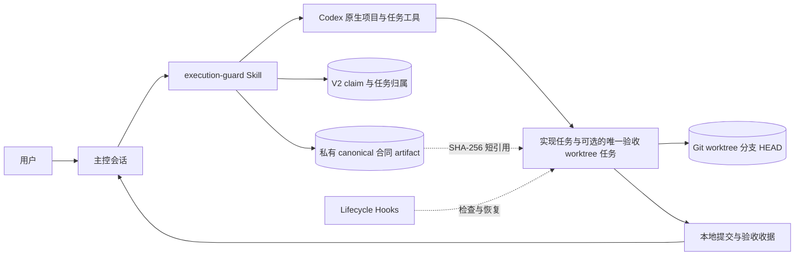

# Codex Execution Guard 架构与原理

[English](ARCHITECTURE.en.md)

## 设计目标

Execution Guard 解决的是“已经确认的实现计划怎样稳定落地”。它不替代产品规划、Codex 原生任务工具或 Git，而是在三者之间建立一份可恢复、可核对的执行边界。

可靠执行需要四种持久信息：

1. 已批准意图：目标、范围、决定、非目标、授权和验收标准。
2. 隔离现场：每条功能链一个实现任务、worktree 和分支；已批准具体隔离需求时，最多再有一条确定性验收 lane。
3. 可恢复进度：稳定计划编号、当前状态、偏差和验证证据。
4. 有边界的出口：按批准合同判断完成，不由执行者继续发明新门槛。

聊天历史会压缩，Git 状态会长期保留并直接影响代码。插件因此把关键执行信息保存成小而明确的结构，不依赖重放整段讨论。

## 总体结构

### 触发层

`AGENTS.md` 把功能链建立与链内 lane 路由分开。没有匹配的 active 功能链 ownership 与 control 身份时，显式 control 意图与已批准、边界充分冻结的真实仓库实施必须同时成立，Control 才能建立功能链。此前的显式调用可在同一项尚未开始的实施澄清中持续作为证据；ownership 完成 finalize 并进入 active 状态后才开始实施，此时路由身份由该 active ownership 与 control chain 接续，用户取消或以独立目标替换时则无交接结束。精确匹配的 active chain 后续工作已获批准时，只有选定 lane 的 active ownership 与原生任务身份精确匹配，才无需再次点名 Guard 并复用实现 lane 或已有验收 lane。若 active implementation chain 后来出现已批准的具体隔离需求，可沿用该身份 claim 唯一的确定性验收 lane：第一次 claim 最多创建一次，后续只 reconcile 或复用，不能生成带重试后缀的 ID。功能链明确 merged 或 cancelled 后，该身份结束。只点名 Skill、研究评审和一次性 Paper、Figma、HTML 探索即使产生代码或使用 `$frontend-design`，也仍留在当前任务。触发层不保存工具调用顺序、模型策略、合同字段或 Hook 状态机。

### Control Skill

Control 路径负责保留产品不确定性和最终决定、判断新建或复用、读取宿主能力、在授权池内路由模型、在创建前持久化一次性 claim、调用 Codex 原生任务工具一次、reconcile 真实任务、取得 worktree 与 Git 基线、finalize 迭代所有权并私有保存执行合同。

Control 不用本地脚本伪造 Codex 任务。本地 registry 只记录已经由原生工具取得的真实身份。

### Execution Skill

Execution 路径只接受合法的版本化合同或已经保存的恢复状态。它核对 Git 现场、原样登记完整 `update_plan`、在允许范围内实现与验证、记录不改变合同的实现说明、把材料变化带回主控，并生成结构化收据。

执行任务不得创建、fork、委派或交接另一个任务。

### Lifecycle Hooks

| 事件 | 作用 |
| --- | --- |
| `UserPromptSubmit` | 解析 inline V1 或私有引用，在创建状态前校验 artifact 与绑定。 |
| `PreToolUse` | 在环境和计划未就绪时拦截受覆盖的写操作。 |
| `PostToolUse` | 记录计划变化和有意义的验证证据。 |
| `PreCompact` | 保存已经结构化的检查点。 |
| `SessionStart` | 在 resume 或 compact 后恢复全部合同边界及完整计划、验收状态。 |
| `Stop` | 未完成时要求继续，完成或合法升级时允许交付。 |

没有标记的普通会话保持 fail-open：不创建 guard 状态，也不阻止工具。

## 两阶段交接

主控创建新 worktree 任务时还不知道真实路径、分支和 `HEAD`，因此不能直接编造合同基线。

第一阶段先在 V2 registry 中原子 claim，再调用一次原生创建工具并发送不带标记的 bootstrap。`clientThreadId`、错误和超时都不会重新授权创建；之后只能 reconcile。零个或多个候选停止，恰好一个真实 `threadId` 才能继续验证环境报告。

第二阶段把验证过的单一候选原子 finalize 为 active，把 canonical 合同写进目标宿主私有 `PLUGIN_DATA`，再向执行任务发送标记和 SHA-256 短引用。执行会话在状态创建前校验 artifact、ownership 和实时基线，然后登记计划。这个顺序既避免合同指向不存在的现场，也避免超长 JSON 占据聊天正文。

## 本地所有权记录

`control_plane.py` 沿用目标宿主已有的私有路径 `PLUGIN_DATA/control/iterations.json` 保存 V2 迭代记录。`claimed` 只包含 iteration、project 和标题，不保存 `clientThreadId`、真实任务或 Git 身份；`active` 增加 host、真实 thread、worktree、分支和完整基线；`closed` 保留同一所有权快照。

写入采用稳定 sidecar 进程锁、加锁后重新读取和验证、完整 read-modify-write 期间持续持锁，以及临时文件与原子替换。并发主控因此不会用旧快照覆盖已经提交的记录。损坏 JSON、重复所有权、不完整记录或基线过期都会停止操作，不会自动覆盖现场。

第一次 claim 返回唯一 `create_once`，后续 claim 永久返回 `reconcile_only`。claim 不自动清除或过期，因此错误、超时、崩溃和重载不会触发第二次创建。V1 文件保持可读，并在下一次持锁写入时整体迁移为 V2。

Registry 本身不增加 checksum；进程锁、结构校验和原子替换继续覆盖并发写入边界。SHA-256 只用于下面的合同 artifact，因为这里存在已复现的“可见合同过长”和跨 prompt 篡改/错绑边界。

## 私有合同交接

`contract_protocol.py` 把完整合同和 active ownership 封装成 canonical JSON，绑定合同 ID、目标 session、host、thread、worktree、分支和基线。artifact 最大 1 MiB，文件名是内容 SHA-256，保存在 `PLUGIN_DATA/contracts/`。

聊天只收到合同 ID、经过 599 UTF-8 字节总上限处理的单行 `goal` 摘要、激活 marker 和一行摘要引用。Hook 依次检查引用格式、大小、hash、合同 ID、session、V2 active ownership、合同基线与实时 Git。任一失败都在 session state 创建前停止；引用与 inline JSON 同时出现也会拒绝。

Inline V1 继续兼容。只有控制端与执行端跨宿主、无法写入目标 `PLUGIN_DATA` 时，才生成明确标注并折叠的 inline fallback；同一宿主的 artifact 错误不能自动降级。

## 执行状态

`execution_guard.py` 保存会话级合同、环境就绪状态、计划状态、验收状态、当前 Git 身份、证据和升级。状态写入同样采用本地原子 JSON 替换。激活与 compact/resume 的私有 Hook 上下文包含全部合同边界、当前完整计划和完整验收数组，源码不按字符数截断。

插件不会保存完整聊天记录、凭据、遥测或远程账户数据。实时合同里的绝对路径只属于当前本机会话，不应该提交到仓库或示例。

## 计划不变形

计划中的每个步骤和验收项都有稳定 ID。执行会话每次更新必须提交完整有序计划，只能改变状态和允许的简短说明，同时最多一个步骤处于 `in_progress`。

新增 ID、删除步骤、改写步骤、重排、扩大路径或降低验收都会被视为合同变化。插件不替主控批准变化，只要求执行会话带证据返回。

## 前进与验证预算

前进必须与当前交付物、真实失败、验收标准或直接阻塞关联。未来生产加固、理论风险、可选能力和无关清理不进入当前计划。

验证证据绑定命令、结果、当前 Git 状态、步骤和验收状态。相同状态下重复检查不会成为新进展；失败变成通过则属于新证据。这个机制限制无效循环，也保留真实根因诊断空间。

## 模型路由

路由分成三种事实：宿主公开的实时模型与思考强度组合、用户授权池，以及宿主返回的实际运行身份。

选择只能来自前两者交集。创建任务接受请求不等于实际身份已经证明。宿主没有运行时身份时，收据保留 `actual model unverified`。插件不会为了追求更强模型自行增加思考强度或终审次数。

## 失败策略

- 普通未激活会话出现本地状态问题时保持无影响。
- 已激活执行会话遇到基线漂移时停止受覆盖的写操作，并返回具体恢复信息。
- 所有权记录与原生任务状态不一致时停在主控协调。
- 已 claim 的创建调用无论返回错误、超时还是排队状态都不得自动重试；reconcile 为零个或多个候选时停止。
- 私有合同缺失、超限、篡改或绑定不一致时不创建部分 session state，也不自动改用 inline 绕过。
- 缺少产品决定、需要新计划 ID 或改变验收时停在主控。
- 宿主无法取得真实任务或环境身份时不开始执行。

失败停止只保护当前受控写入，不声称提供通用沙箱或完整安全隔离。

## 安全与隐私边界

- 没有 MCP server、托管服务、数据库、遥测或运行时网络请求。
- Hook 命令只调用插件内 Python 脚本。
- registry 和执行状态留在用户选择的本地可写路径。
- 默认禁止远程 Git 与发布动作，除非当前目标获得明确授权。
- Hooks 可能无法拦截宿主的全部工具路径，所以不能当成安全边界。

安全报告流程见 [SECURITY.md](../SECURITY.md)。
